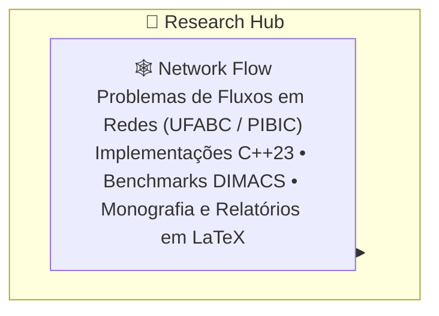

# 🔬 Research Hub

> **Orquestrador Federado de Pesquisa Científica & Otimização Combinatória**<br />
> _O laboratório de investigação acadêmica e matemática aplicada de Gabriel Frigo (UFABC / PIBIC)._

<div align="center">

[](LICENSE)
[](Network%20Flow/)
[](https://www.latex-project.org/)
[](http://dimacs.rutgers.edu/)
[](https://github.com/GabrielFrigo4/research/actions/workflows/submodules.yml)
[](https://github.com/GabrielFrigo4)

</div>

---

## 📖 Visão Geral

O repositório **Research** centraliza os projetos de pesquisa científica, publicações acadêmicas em LaTeX e implementações computacionais rigorosas na interseção entre Ciência da Computação, Teoria dos Grafos e Otimização Combinatória:



---

## 🧩 Os Componentes do Research

| Componente                            | Foco & Responsabilidade                                                        | Tecnologias Centrais             | Repositório Remoto                                                              |
| :------------------------------------ | :----------------------------------------------------------------------------- | :------------------------------- | :------------------------------------------------------------------------------ |
| [**`Network Flow`**](Network%20Flow/) | Teoria, algoritmos (Max Flow & Min-Cost Flow), experimentos e monografia LaTeX | C++23, LaTeX, DIMACS, POSIX Make | [`GabrielFrigo4/networks-flow`](https://github.com/GabrielFrigo4/networks-flow) |

---

## 🚀 Como Obter e Operar

```sh
# Clonagem recursiva
git clone --recursive "https://github.com/GabrielFrigo4/research.git"
cd research

# Ou clonagem simples seguida de bootstrap
git clone "https://github.com/GabrielFrigo4/research.git"
cd research
make clone
```

### Operações com o Makefile

```sh
make status    # Verifica estado de sincronização dos submódulos
make pull      # Atualiza com as branches principais remotas
make test      # Executa sanity checks locais
```

---

## 📜 Governança e Princípios

- **Princípios de Engenharia:** Consulte [PRINCIPLES.md](PRINCIPLES.md) para os 18 princípios canônicos aplicados.
- **AI Agent Briefing:** Instruções de operação para agentes autônomos em [AGENTS.md](AGENTS.md).
